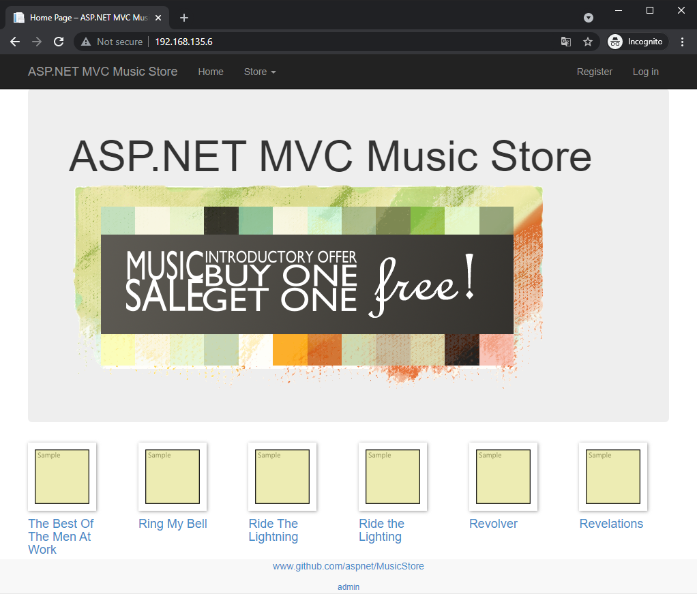

# music-store-app

This repo consists of a compiled .net core 1.0 music store app. It also includes a powershell file that will install this app on a windows server. This application requires a SQL DB backend. It can be SQL PaaS Database and the details must be provided to the script. 

Following is a preview of the application 



## Azure VM extensions
You can use this in Azure VM Extensions to automate the application installation. Following is an example in terraform how the VM extension is passed. 

```terraform
resource "azurerm_virtual_machine_extension" "vm-extension" {
  name                 = "musicstore"
  virtual_machine_id   = module.virtual-machine.vm_id
  publisher            = "Microsoft.Compute"
  type                 = "CustomScriptExtension"
  type_handler_version = "1.10"

  settings = <<SETTINGS
    {
        "commandToExecute": "powershell -ExecutionPolicy Unrestricted -File MusicStore.ps1 -user ${local.sqladmin} -password ${local.sqlpassword} -sqlserver ${azurerm_mssql_server.sqlserver1.fully_qualified_domain_name} -sqldbname ${azurerm_mssql_database.sqldb1.name}",
        "fileUris": ["https://raw.githubusercontent.com/sameeraman/musicstore-app/main/MusicStore.ps1"]
    }
SETTINGS

  tags                = var.tags
  depends_on          = [module.resource_group_web, module.virtual-machine, azurerm_mssql_server.sqlserver1, azurerm_mssql_database.sqldb1 ]
}
```